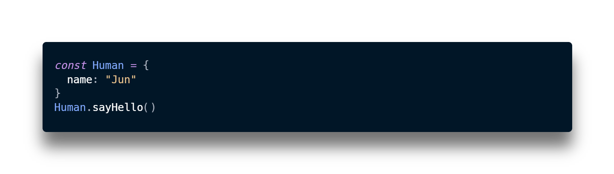
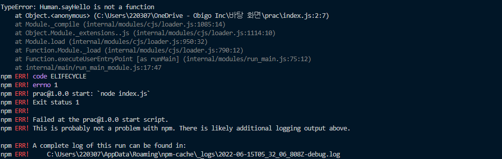
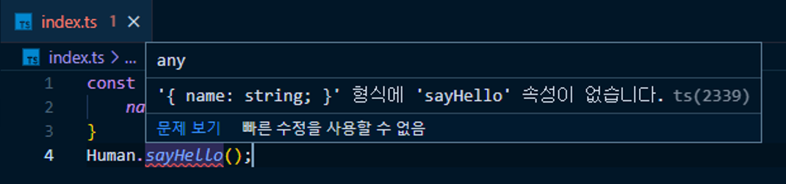

# Typescript 세미나 발표자료

## 목차

- 개요
  - 자바스크립트 역사
  - 자바스크립트 문제점
  - 타입스크립트란?
  - 타입스크립트를 사용해야 하는 이유
- 실제 오비고 사용사례
- 분석
- 개선점
- Q&A

## 개요

이미 아시겠지만 타입스크립트는 한 마디로 확장된 자바스크립트라고 할 수 있습니다. 따라서 타입스크립트에 대해 알아보기 앞서 자바스크립트의 역사를 간략하게나마 알아보도록 하겠습니다.

#### 자바스크립트 역사

자바스크립트는 1995년 12월에 브랜던 아이크에 의해 만들어졌습니다. 자바스크립트는 넷스케이프라는 브라우저의 상호작용성을 높이기 위해 만들어진 언어로, 개발에 단 10일밖에 걸리지 않았습니다.

이후 인터넷 붐이 일어났고, 사람들은 또다른 프로그래밍 언어를 만들기보다는 이미 만들어져 있는 자바스크립트를 써야겠다고 결정하게 되었습니다. -> 근거 좀 부족

그 결과 JS의 사용량은 급증하게 되었고, 이에 대응하는 지속적인 패치를 통해 자바스크립트는 전체 스택을 프로그래밍할 수 있을 정도의 기능을 갖춘 엄청난 언어로 탈바꿈하게 되었습니다.

현재 자바스크립트는 굉장한 프로그래밍 언어임에는 틀림없지만, 아까도 언급했듯이 자바스크립트는 10일만에 만들어진 언어입니다. 이런 자랑스럽지만은 않은 시작은 많은 문제들을 만들게 되었습니다.

예시를 통해 살펴보겠습니다.

#### 자바스크립트의 문제점



	

위의 코드에서 정의되지 않은 sayHello 라는 메서드에 접근하려고 했고, 코드 실행 이후 런타임 에러가 발생합니다.

자바스크립트의 문제점은 사전에 어떠한 검사도 이루어지지 않기 때문에 코드를 실행시켜야만 문제점을 발견할 수 있다는 점입니다.

사실 코드를 실행하기 전에 Human 이라는 객체를 분석하고 사용자에게 sayHello 메서드가 없다는 걸 알려주는 것이 가장 이상적인 프로그래밍 언어라고 할 수 있을 것입니다.

여기서 필요한 것이 바로 타입스크립트입니다. 타입스크립트를 사용한다면 위의 문제점들을 전혀 신경쓰지 않아도 됩니다.

#### 타입스크립트란?

> 타입스크립트는 자바스크립트로 컴파일되는, 자바스크립트의 타입이 있는 상위집합입니다. 
>
> *TypeScript is a typed superset of JavaScript that compiles to plain JavaScript.*

먼저 타입이 있는 자바스크립트란 정적 타입 시스템을 도입한 자바스크립트라는 뜻입니다. 정적 타입 시스템이 있는 언어, 즉 정적 타입 언어에서는 프로그램의 예상 동작을 타입을 통해 나타내고, 그 예상에 걸맞게 동작할 지의 여부를 타입 검사기를 통해 실행 전에 확인할 수 있습니다.

#### 타입스크립트를 사용해야 하는 이유

- 에러의 사전 방지
- 코드 가이드 및 자동완성(개발 생산성 향상)
- 쉬운 마이그레이션

##### 에러의 사전 방지

앞서 자바스크립트의 문제점은 어떠한 검사도 없이 코드가 실행되기 때문에 코드가 실행되고 나서야 그 결과를 통해 문제를 파악할 수 있다고 했습니다. 아까 살펴본 예시를 타입스크립트 파일에 작성해보도록 하겠습니다. 

위와 같이 코드를 실행시키기 전에 메시지를 확인하고 런타임 에러를 발생시키지 않도록 코드를 수정할 수 있게 되는 것입니다.

너무 자유로운 자바스크립트에 강제성을 부여해 안정성을 확보하는 것, 이것이 타입스크립트를 사용하는 가장 큰 이유라고 할 수 있겠습니다. 하지만 타입스크립트를 사용해야 하는 이유는 이외에도 많습니다.

##### 코드 가이드 및 자동완성(개발 생산성 향상)

타입스크립트를 사용해야 하는 또 다른 이유는 코드를 작성할 때 개발 툴의 기능을 최대로 활용할 수 있다는 것입니다. 요즘에 프론트엔드 개발을 할 때 가장 많이 사용되는 Visual Studio Code는 툴의 내부가 타입스크립트로 작성되어 있어 타입스크립트 개발에 최적화 되어 있습니다.

```javascript
// math.js
function sum(a, b) {
  return a + b;
}
var total = sum(10, 20);
total.toLocaleString();
```

위 코드는 앞에서 살펴봤던 `sum()` 함수를 이용하여 두 숫자의 합을 구한 다음 `toLocaleString()`(특정 언어의 표현 방식에 맞게 숫자를 표기하는 API)를 적용한 코드입니다.

여기서 주목해야 할 부분은 같이 코드를 작성하는 시점에는 자바스크립트가 `total`이라는 변수의 타입을 인지하지 못한다는 점입니다.

위에서 볼 수 있듯이 `total`이라는 변수의 타입이 정해져 있지 않기 때문에 자바스크립트 Number에서 제공하는 API인 `toLocaleString()`을 일일이 작성했습니다. 이제 타입스크립트 파일에 코드를 작성해보겠습니다.

```typescript
function sum(a: number, b: number): number {
  return a + b;
}
var total = sum(10, 20);
total.toLocaleString();
```


변수 `total`에 대한 타입이 지정되어 있기 때문에 VSCode에서 해당 타입에 대한 API를 미리 보기로 띄워줄 수 있고 API를 다 일일이 치는 것이 아니라 tab으로 빠르고 정확하게 작성해나갈 수 있습니다. 

#### 쉬운 마이그레이션

##### 구문

TypeScript는 JS의 구문이 허용되는, JavaScript의 상위 집합 언어입니다. 여기서 구문은 프로그램을 만들기 위해 코드를 작성하는 방법을 의미합니다. 

자바스크립트의 구문이 허용되기 때문에 문제없이 실행되는 자바스크립트 코드라면 어떻게 작성되었는지에 상관없이 타입스크립트 파일에 옮겨 실행시킬 수 있습니다. 

##### 런타임 특성 (Runtime Behavior)

또한 타입스크립트는 자바스크립트의 런타임 특성을 가지고 있습니다. 예를 들어, JavaScript에서 0으로 나누는 행동은 런타임 예외로 처리하지 않고 `Infinity`값을 반환합니다. 원칙적으로, TypeScript는 JavaScript 코드의 런타임 특성을 **절대** 변화시키지 않습니다.

즉, 타입스크립트가 자바스크립트 코드에 타입 오류가 있음을 검출해도, 타입스크립트 파일에서 자바스크립트 코드는 동일한 방식으로 실행됩니다.

___

여기까지 타입스크립트란 무엇인지 왜 필요한지에 대해서 알아봤습니다. 그러면 이제 오비고에서는 타입스크립트를 어떻게 사용하고 있고, 개선할 부분들이 있는지 살펴보도록 하겠습니다.

### 오비고 실제 사용사례

```tsx
export interface IObigoAudioElement {
  play (): void
  pause (): void
  getAttribute (qualifiedName: string): string | null
  setAttribute (qualifiedName: string, value: string): void
  removeAttribute (qualifiedName: string): void
  getTimeInfo (): any
  setMetaData (mdata: MediaMetadataInit): void
}
```

분석해볼 소스 코드는 현재 담당하고 있는 개인화 서비스 팟캐스트 애플리케이션에서 사용하고 있는 IobigoAudioElement와 그로부터 만들어진 ObigoAudioElement 클래스입니다.

#### 타입과 인터페이스

가장 먼저 살펴볼 부분은 IObigoAudioElement가 인터페이스로 정의되어있다는 점입니다.

타입스크립트에서 타입을 구축하는 구문에는 타입과 인터페이스가 있습니다.

둘은 굉장히 비슷하며, 대부분의 경우 동일하게 동작합니다.

하지만 몇 가지 차이점이 존재하는데요, 예시를 통해 살펴보도록 하겠습니다.


앞에 보시면 BirdType 이라는 타입이 정의되어있습니다. 해당 타입은 wings, 날개라는 속성에 2라는 값을 반드시 가지고 있어야 합니다. 

이제 BirdType을 다른 타입과 인터페이스를 확장하는데 사용해보겠습니다.


이제 Owl 이라는 타입을 정의해보도록 하겠습니다. 

Owl은 기본적으로 BirdType의 특성을 갖고, 야행성 속성에 대한 값을 추가적으로 갖고 있습니다.

확장을 위해서 인터섹션 타입을 사용하는데, & 키워드를 사용합니다. 여기서 인터섹션 타입이란 여러 타입을 모두 만족하는 하나의 타입을 의미합니다.


기본적으로 타입스크립트는 구조적 타입 시스템이기 때문에 타입과 인터페이스를 교차사용하는 것이 가능합니다.

Chicken 이라는 인터페이스를 정의할 때 확장을 위해 extends 라는 키워드를 사용했고, Type을 교차 사용한 것을 확인할 수 있습니다.


그리고 이제 두 번째 차이점을 알아보겠습니다.

가장 큰 차이점은 Type은 닫혀 있고, Interface는 열려 있다는 점입니다.

예시를 통해 살펴보겠습니다.


타입은 한 번 정의하고 나서 다시 정의하는 것이 불가능합니다. 동일한 타입으로 간주되어 중복된 타입이라는 오류 메시지가 뜨는 것을 확인할 수 있습니다.

하지만 인터페이스의 경우에는 두 번째 선언을 통해 재정의가 가능합니다.

tasty 라는 속성에 true 라는 값을 추가해 재정의를 해보겠습니다.

밑에 chicken interface를 갖는 chicken 변수에 오류 메시지가 뜬 걸 확인할 수 있습니다.


이렇게 두 가지 차이점이 있습니다. 하지만 공식 문서에서는 인터페이스 사용을 훨씬 더 권장하고 있는데요, 그 이유는 인터페이스가 더 자세한 오류 메시지를 제공하기 때문입니다.

하지만 최근 업데이트에 의해 타입에서도 동일하게 자세한 오류 메시지를 제공하고 있습니다.

그래서 공식 문서에 나오는 이유를 따라 인터페이스를 사용하는 것은 올바르지 않다고 생각합니다.


결국 본인이 어떤 목적을 가지고 있느냐에 따라 타입과 인터페이스를 구분해 사용하는 것이 가장 합리적이라고 생각됩니다.

먼저 타입 alias는 Type Alias는 단순히 Type을 정의하고 제한하는 목적일 때 적합합니다. 상속이나 확장이 불필요하고 단순 원시 값으로 사용되는 경우에 사용합니다.
Type Alias는 심플하지만 확장성에서 제한이 있습니다. 만약 객체지향프로그래밍의 객체를 구현하는 경우라면 interface나 class 사용을 권장합니다.


오비고도 이러한 이유에서 인터페이스를 사용했다고 생각합니다.

화면을 보시겠습니다.


화면을 보시면 ObigoAudioElement에서 IObigoAudioElement를 implements 하고 있는 걸 볼 수 있습니다.

이는 일반적인 객체지향언어의 인터페이스 특성을 사용한 것입니다.

객체지향프로그래밍을 하는 가장 큰 이유는 소프트웨어의 생산성을 향상시키기 위함입니다.


개인화 서비스는 이전에 만들었던 tmobi 템플릿을 바탕으로 만들어진 프로젝트라고 알고 있습니다.

tmobi 템플릿은 

결국 클래스 사용은 필수적이라고 할 수 있습니다. 그리고 이런 객체지향성 프로그래밍을 위해서는 결국 클래스가 필수적이고, vue 라는 자바스크립트 라이브러리와 함께 사용하기 위해서는 타입스크립트를 사용하는 것이 굉장히 효과적이라고 할 수 있습니다.


## `any`

TypeScript also has a special type, `any`, that you can use whenever you don’t want a particular value to cause typechecking errors.

When a value is of type `any`, you can access any properties of it (which will in turn be of type `any`), call it like a function, assign it to (or from) a value of any type, or pretty much anything else that’s syntactically legal:

```
let obj: any = { x: 0 };
// None of the following lines of code will throw compiler errors.
// Using `any` disables all further type checking, and it is assumed 
// you know the environment better than TypeScript.
obj.foo();
obj();
obj.bar = 100;
obj = "hello";
const n: number = obj;Try
```

The `any` type is useful when you don’t want to write out a long type just to convince TypeScript that a particular line of code is okay.

오비고가 인포테인먼트 서비스를 계속 이후에도 계속 사용될 수 있다는 점에서 확장성을 가지고 있다고 할 수 있습니다. 단지 한 번만 쓰고 버리는 프로젝트가 아니라는 점입니다. 따라서 좀 더 정교하게 만들어질 필요가 있다고 생각했습니다.

이러한 관점에서 위의 AudioElement의 any의 사용이 개선되어야 할 필요가 있다고 생각했습니다.

먼저 any 라는 타입은 

하지만 그보다는 타입스크립트의 강제성에서 벗어나는 일종의 탈출장치 라고 보는 편이 더 맞다고 생각합니다.

공식문서에서도 다음과 같이 표현하고 있으며, 이는 각주와 같은 역할을 한다고 생각합니다.

"변화"보다 "계획"에 중점을 맞추고 있는 타입스크립트인만큼 공

사실 audioElement의 리턴값 하나만을 가지고 개선할 방향을 정한다는 것은 무리가 있다고 생각합니다.

다만 

재사용을 위해 만들어진 프로젝트이기 때문에 

앞으로 인포테인먼트 서비스를 제공할 기회가 있다면 재사용할 수 있는 가능성이 있는 프로젝트이기 때문에 좀 더 계획적이고 구체적인 프로그래밍을 추구해야한다는 점을 말씀드리고 싶었습니다. 그리고 


vue 가 자바스크립트 프레임워크인만큼 타입스크립트를 사용하는 것이 


[[TypeScript\] Type, Interface, Class (tistory.com)](https://points.tistory.com/104)

객체지향프로그래밍의 객체를 구현하고 있다는 점에 interface 를 사용하는 것이 권장됩니다.

생성자를 통해 

 일반적인 객체지향언어의 interface의 특성을 사용해야 하기 때문입니다.


any 사용


템플릿은 틀입니다. 많은 애플리케이션을 위에 구현할 수 있도록 유연해야할 것입니다.

따라서 AudioElement 등 수많은 것들을 받을 수 있도록 유연해야겠지만 그 안을 구현하고 있는 코드들은 정교해야만 다양한 애플리케이션을 위에서 구현하는데 문제가 없을 것이라고 생각합니다. 

최근 Vue 소스 코드를 분석하고 있는데, 깃허브 저장소에 보니 사용된 프로그래밍 언어의 97.1 % 가 타입스크립트임을 확인할 수 있었습니다. 


# :books:참고자료

- https://www.typescriptlang.org/docs/handbook/typescript-from-scratch.html - 타입스크립트 핸드북 new programmers
- https://slides.com/woongjae/woowahan-ts#/15/4 - 우아한 타입스크립트 세미나

- 노마드코더 강의
- https://ahnheejong.gitbook.io/ts-for-jsdev/01-introducing-typescript/intro